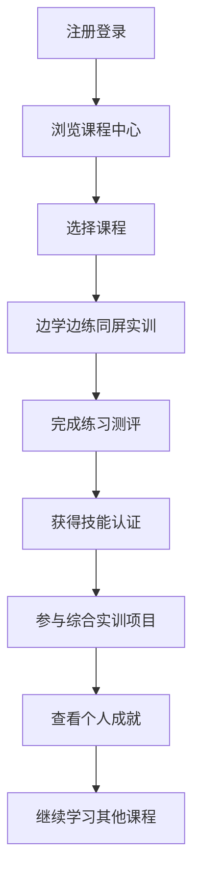

## 1. 产品概述
基于Python的数据分析在线教育平台，专为商务数据分析与应用专业学生设计，提供完整的课程体系和互动式学习体验。
- 解决商务数据分析专业学生缺乏实践环境和真实项目经验的问题，提供沉浸式学习体验。
- 目标市场为高等教育机构和职业培训机构，帮助学生掌握行业所需的数据分析技能。

## 2. 核心功能

### 2.1 用户角色
| 角色 | 注册方式 | 核心权限 |
|------|---------------------|------------------|
| 学生 | 邮箱注册 | 浏览课程、参与学习、完成练习、查看成就 |
| 教师 | 邀请码注册 | 管理课程、查看学生进度、评估作业 |

### 2.2 功能模块
1. **首页**：平台介绍、课程体系概览、最新动态
2. **课程中心**：专业基础课、专业核心课、案例实战与拓展课
3. **学习模块**：边学边练同屏实训、多工具集成沙箱
4. **数据资源**：公共数据集中心、综合实训项目
5. **个人中心**：学习进度、成就系统、个人资料

### 2.3 页面详情
| 页面名称 | 模块名称 | 功能描述 |
|-----------|-------------|---------------------|
| 首页 | 平台介绍 | 展示平台定位、核心优势和学习路径 |
| 首页 | 课程体系概览 | 可视化展示三大课程板块和技能路径图 |
| 课程中心 | 专业基础课 | 提供电子商务基础、市场营销基础、应用统计、Python基础等课程 |
| 课程中心 | 专业核心课 | 提供数据采集与处理、各类管理数据分析、数据可视化等课程 |
| 课程中心 | 案例实战与拓展课 | 提供智慧商业、企业真实运营项目、行业分析报告撰写等课程 |
| 学习模块 | 边学边练同屏实训 | 左指导书/视频，右实训环境的布局，支持同步学习和实践 |
| 学习模块 | Python在线编程环境 | 集成安全的Python代码编辑器，支持主流库，包含10个Python练习题 |
| 学习模块 | SQL查询模拟器 | 提供模拟数据库环境，训练数据抽取与查询能力 |
| 学习模块 | 零代码BI工具模拟 | 集成九数云BI拖拽式可视化工具的模拟操作界面 |
| 学习模块 | 数据采集工具模拟 | 提供简单的网络爬虫配置界面，理解数据采集原理 |
| 数据资源 | 公共数据集中心 | 提供多行业、多场景的真实或脱敏数据集，支持预览和下载 |
| 数据资源 | 综合实训项目 | 设计基于企业真实业务场景的完整项目，涵盖全流程分析 |
| 个人中心 | 学习进度 | 追踪课程完成情况和技能掌握程度 |
| 个人中心 | 成就系统 | 展示获得的徽章、证书和技能认证 |
| 个人中心 | 个人资料 | 管理个人信息和学习偏好 |

## 3. 核心流程
**学生学习流程**：
1. 学生注册登录平台
2. 浏览课程体系，选择感兴趣的课程
3. 进入课程学习页面，查看课程内容和目标岗位
4. 在边学边练界面中，跟随左侧指导在右侧实训环境中实践
5. 完成练习和测评，获得技能认证
6. 参与综合实训项目，应用所学技能
7. 查看个人成就和学习进度

**教师管理流程**：
1. 教师通过邀请码注册登录
2. 查看学生学习情况和进度
3. 评估学生作业和项目成果
4. 管理课程内容和练习题库

## 4. 用户界面设计
### 4.1 设计风格
- 主色调：科技蓝 (#1E40AF) 和活力橙 (#F97316)
- 辅助色：浅灰 (#F3F4F6) 和深灰 (#374151)
- 按钮风格：圆角矩形，有轻微阴影和悬停效果
- 字体：主标题使用 Inter 加粗，正文使用 Inter 常规
- 字体大小：标题 24-32px，副标题 18-20px，正文 14-16px
- 布局风格：卡片式布局，顶部导航，响应式设计
- 图标风格：线性图标，简洁现代

### 4.2 页面设计概览
| 页面名称 | 模块名称 | UI元素 |
|-----------|-------------|---------------------|
| 首页 | 平台介绍 | 全屏英雄区，渐变背景，简洁标题和副标题，CTA按钮 |
| 首页 | 课程体系概览 | 交互式技能路径图，彩色分类卡片，悬停效果 |
| 课程中心 | 课程分类 | 标签式导航，卡片网格布局，课程封面图和简介 |
| 学习模块 | 边学边练界面 | 左右分栏布局，左侧滚动指导书，右侧代码编辑器或工具界面 |
| 学习模块 | 编程环境 | 代码编辑器，语法高亮，运行按钮，输出面板 |
| 数据资源 | 数据集中心 | 卡片式展示，筛选器，搜索功能，预览按钮 |
| 个人中心 | 成就系统 | 徽章墙，进度条，技能雷达图 |

### 4.3 响应式设计
- 桌面优先设计，支持平板和移动设备
- 断点设置：1200px（桌面）、768px（平板）、480px（移动）
- 在移动设备上，边学边练界面改为上下布局
- 导航栏在移动设备上转为汉堡菜单

### 4.4 交互设计
- 平滑的页面过渡和组件动画
- 悬停效果：按钮、卡片、链接的状态变化
- 加载状态：骨架屏和进度指示器
- 反馈机制：操作成功/失败的提示消息
- 微交互：滚动效果、数字增长动画、成就解锁动画