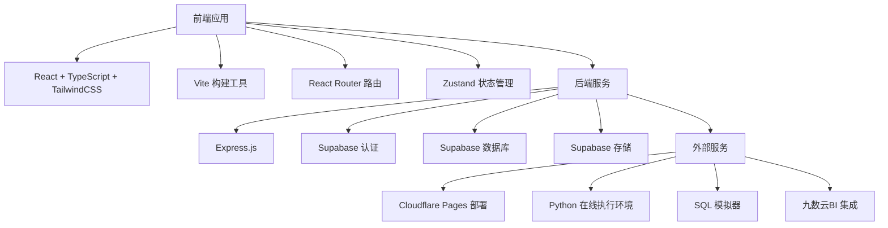
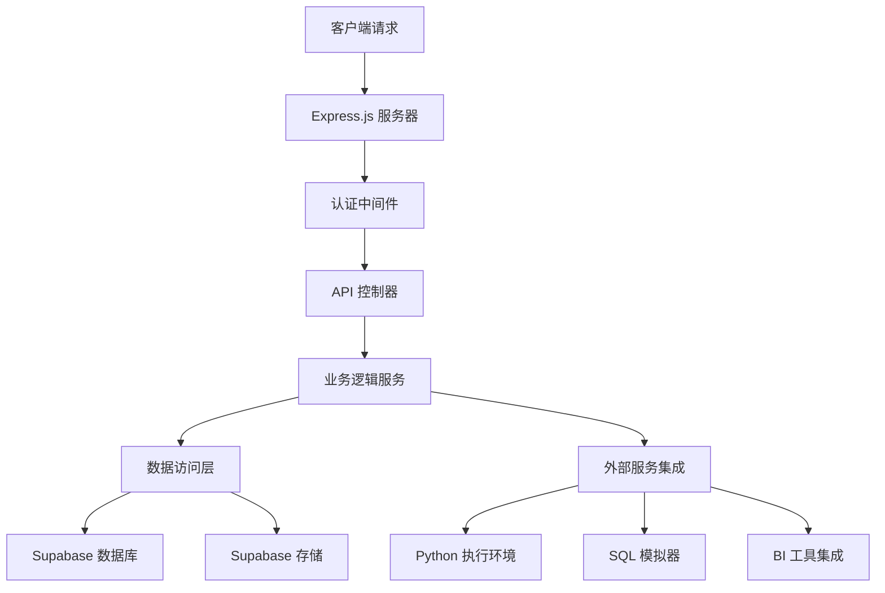
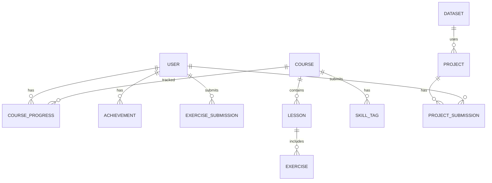

## 1. 架构设计


## 2. 技术描述
- 前端：React@18 + TypeScript + TailwindCSS@3 + Vite
- 初始化工具：vite-init
- 后端：Express.js@4 + Supabase
- 数据库：Supabase (PostgreSQL)
- 部署：Cloudflare Pages

## 3. 路由定义
| 路由 | 目的 |
|-------|---------|
| / | 首页，平台介绍和课程体系概览 |
| /courses | 课程中心，展示所有课程分类 |
| /courses/:category | 特定课程分类页面 |
| /courses/:category/:courseId | 课程详情页面 |
| /learning | 学习模块，边学边练同屏实训 |
| /learning/python | Python在线编程环境 |
| /learning/sql | SQL查询模拟器 |
| /learning/bi | 零代码BI工具模拟 |
| /learning/scraping | 数据采集工具模拟 |
| /datasets | 公共数据集中心 |
| /projects | 综合实训项目 |
| /profile | 个人中心，学习进度和成就 |
| /login | 登录页面 |
| /register | 注册页面 |

## 4. API定义
### 4.1 认证API
| 端点 | 方法 | 功能 | 请求体 | 响应 |
|-------|------|---------|---------|---------|
| /api/auth/register | POST | 学生注册 | { email, password, name } | { user, token } |
| /api/auth/login | POST | 用户登录 | { email, password } | { user, token } |
| /api/auth/teacher/register | POST | 教师注册 | { email, password, name, inviteCode } | { user, token } |

### 4.2 课程API
| 端点 | 方法 | 功能 | 请求体 | 响应 |
|-------|------|---------|---------|---------|
| /api/courses | GET | 获取所有课程 | N/A | { courses: [...] } |
| /api/courses/:category | GET | 获取特定分类课程 | N/A | { courses: [...] } |
| /api/courses/:id | GET | 获取课程详情 | N/A | { course: {...} } |
| /api/courses/:id/lessons | GET | 获取课程章节 | N/A | { lessons: [...] } |

### 4.3 学习API
| 端点 | 方法 | 功能 | 请求体 | 响应 |
|-------|------|---------|---------|---------|
| /api/learning/progress | GET | 获取学习进度 | N/A | { progress: {...} } |
| /api/learning/progress | POST | 更新学习进度 | { courseId, lessonId, completed } | { success: true } |
| /api/learning/exercises | GET | 获取练习题 | N/A | { exercises: [...] } |
| /api/learning/exercises/:id/submit | POST | 提交练习答案 | { answer } | { result: {...} } |

### 4.4 数据资源API
| 端点 | 方法 | 功能 | 请求体 | 响应 |
|-------|------|---------|---------|---------|
| /api/datasets | GET | 获取数据集列表 | N/A | { datasets: [...] } |
| /api/datasets/:id | GET | 获取数据集详情 | N/A | { dataset: {...} } |
| /api/datasets/:id/download | GET | 下载数据集 | N/A | 文件流 |
| /api/projects | GET | 获取实训项目列表 | N/A | { projects: [...] } |
| /api/projects/:id | GET | 获取项目详情 | N/A | { project: {...} } |

### 4.5 成就API
| 端点 | 方法 | 功能 | 请求体 | 响应 |
|-------|------|---------|---------|---------|
| /api/achievements | GET | 获取用户成就 | N/A | { achievements: [...] } |
| /api/achievements/earn | POST | 授予成就 | { achievementId } | { success: true } |

## 5. 服务器架构图


## 6. 数据模型
### 6.1 数据模型定义


### 6.2 数据定义语言
#### 用户表 (users)
```sql
CREATE TABLE users (
  id UUID PRIMARY KEY DEFAULT gen_random_uuid(),
  email VARCHAR(255) UNIQUE NOT NULL,
  password_hash VARCHAR(255) NOT NULL,
  name VARCHAR(100) NOT NULL,
  role VARCHAR(20) NOT NULL DEFAULT 'student',
  created_at TIMESTAMP DEFAULT NOW(),
  updated_at TIMESTAMP DEFAULT NOW()
);

CREATE INDEX idx_users_email ON users(email);
CREATE INDEX idx_users_role ON users(role);
```

#### 课程表 (courses)
```sql
CREATE TABLE courses (
  id UUID PRIMARY KEY DEFAULT gen_random_uuid(),
  title VARCHAR(255) NOT NULL,
  description TEXT NOT NULL,
  category VARCHAR(50) NOT NULL,
  level VARCHAR(20) NOT NULL,
  duration INTEGER NOT NULL, -- 课时
  target_jobs TEXT[] NOT NULL,
  typical_tasks TEXT[] NOT NULL,
  created_at TIMESTAMP DEFAULT NOW(),
  updated_at TIMESTAMP DEFAULT NOW()
);

CREATE INDEX idx_courses_category ON courses(category);
CREATE INDEX idx_courses_level ON courses(level);
```

#### 课程章节表 (lessons)
```sql
CREATE TABLE lessons (
  id UUID PRIMARY KEY DEFAULT gen_random_uuid(),
  course_id UUID NOT NULL REFERENCES courses(id),
  title VARCHAR(255) NOT NULL,
  content TEXT NOT NULL,
  order_number INTEGER NOT NULL,
  created_at TIMESTAMP DEFAULT NOW(),
  updated_at TIMESTAMP DEFAULT NOW()
);

CREATE INDEX idx_lessons_course_id ON lessons(course_id);
CREATE INDEX idx_lessons_order ON lessons(order_number);
```

#### 技能标签表 (skill_tags)
```sql
CREATE TABLE skill_tags (
  id UUID PRIMARY KEY DEFAULT gen_random_uuid(),
  name VARCHAR(50) UNIQUE NOT NULL,
  description TEXT,
  created_at TIMESTAMP DEFAULT NOW()
);

CREATE TABLE course_skill_tags (
  course_id UUID NOT NULL REFERENCES courses(id),
  skill_tag_id UUID NOT NULL REFERENCES skill_tags(id),
  PRIMARY KEY (course_id, skill_tag_id)
);
```

#### 学习进度表 (course_progress)
```sql
CREATE TABLE course_progress (
  id UUID PRIMARY KEY DEFAULT gen_random_uuid(),
  user_id UUID NOT NULL REFERENCES users(id),
  course_id UUID NOT NULL REFERENCES courses(id),
  completed_lessons INTEGER DEFAULT 0,
  total_lessons INTEGER NOT NULL,
  progress_percentage INTEGER DEFAULT 0,
  completed BOOLEAN DEFAULT FALSE,
  created_at TIMESTAMP DEFAULT NOW(),
  updated_at TIMESTAMP DEFAULT NOW()
);

CREATE UNIQUE INDEX idx_progress_user_course ON course_progress(user_id, course_id);
```

#### 练习表 (exercises)
```sql
CREATE TABLE exercises (
  id UUID PRIMARY KEY DEFAULT gen_random_uuid(),
  lesson_id UUID NOT NULL REFERENCES lessons(id),
  title VARCHAR(255) NOT NULL,
  description TEXT NOT NULL,
  type VARCHAR(20) NOT NULL, -- python, sql, bi, scraping
  difficulty VARCHAR(20) NOT NULL,
  solution TEXT NOT NULL,
  created_at TIMESTAMP DEFAULT NOW()
);

CREATE INDEX idx_exercises_lesson_id ON exercises(lesson_id);
CREATE INDEX idx_exercises_type ON exercises(type);
```

#### 练习提交表 (exercise_submissions)
```sql
CREATE TABLE exercise_submissions (
  id UUID PRIMARY KEY DEFAULT gen_random_uuid(),
  user_id UUID NOT NULL REFERENCES users(id),
  exercise_id UUID NOT NULL REFERENCES exercises(id),
  answer TEXT NOT NULL,
  score INTEGER DEFAULT 0,
  feedback TEXT,
  submitted_at TIMESTAMP DEFAULT NOW()
);

CREATE INDEX idx_submissions_user_id ON exercise_submissions(user_id);
CREATE INDEX idx_submissions_exercise_id ON exercise_submissions(exercise_id);
```

#### 成就表 (achievements)
```sql
CREATE TABLE achievements (
  id UUID PRIMARY KEY DEFAULT gen_random_uuid(),
  name VARCHAR(100) NOT NULL,
  description TEXT NOT NULL,
  icon VARCHAR(255) NOT NULL,
  rarity VARCHAR(20) NOT NULL,
  created_at TIMESTAMP DEFAULT NOW()
);

CREATE TABLE user_achievements (
  user_id UUID NOT NULL REFERENCES users(id),
  achievement_id UUID NOT NULL REFERENCES achievements(id),
  earned_at TIMESTAMP DEFAULT NOW(),
  PRIMARY KEY (user_id, achievement_id)
);
```

#### 数据集表 (datasets)
```sql
CREATE TABLE datasets (
  id UUID PRIMARY KEY DEFAULT gen_random_uuid(),
  name VARCHAR(255) NOT NULL,
  description TEXT NOT NULL,
  category VARCHAR(50) NOT NULL,
  file_url VARCHAR(255) NOT NULL,
  preview_url VARCHAR(255),
  size INTEGER NOT NULL, -- 文件大小（字节）
  created_at TIMESTAMP DEFAULT NOW()
);

CREATE INDEX idx_datasets_category ON datasets(category);
```

#### 实训项目表 (projects)
```sql
CREATE TABLE projects (
  id UUID PRIMARY KEY DEFAULT gen_random_uuid(),
  title VARCHAR(255) NOT NULL,
  description TEXT NOT NULL,
  difficulty VARCHAR(20) NOT NULL,
  duration INTEGER NOT NULL, -- 预计完成时间（小时）
  dataset_id UUID REFERENCES datasets(id),
  requirements TEXT NOT NULL,
  created_at TIMESTAMP DEFAULT NOW()
);

CREATE INDEX idx_projects_difficulty ON projects(difficulty);
```

#### 项目提交表 (project_submissions)
```sql
CREATE TABLE project_submissions (
  id UUID PRIMARY KEY DEFAULT gen_random_uuid(),
  user_id UUID NOT NULL REFERENCES users(id),
  project_id UUID NOT NULL REFERENCES projects(id),
  submission_url VARCHAR(255) NOT NULL,
  description TEXT,
  score INTEGER DEFAULT 0,
  feedback TEXT,
  submitted_at TIMESTAMP DEFAULT NOW()
);

CREATE INDEX idx_project_submissions_user_id ON project_submissions(user_id);
CREATE INDEX idx_project_submissions_project_id ON project_submissions(project_id);
```